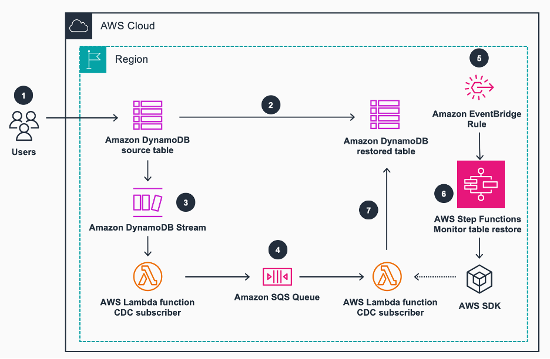
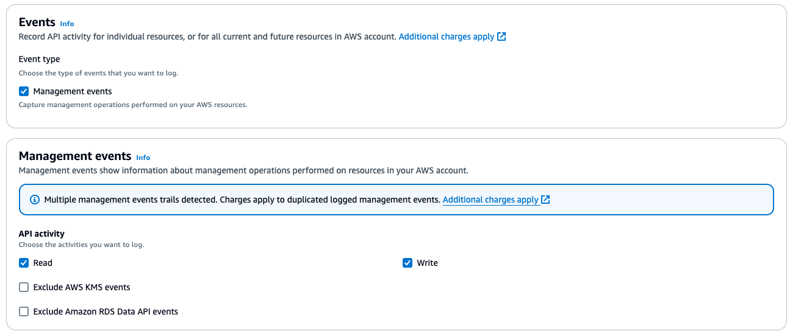

# Capture data changes while restoring an Amazon DynamoDB table

In this repository you will find the precedure to implement Point In Time Restore (PITR) to a DynamoDB table to any point in the last 35 days with a near zero-downtime approach.



1. The “source table” will serve Live traffic
2. You, as a System Administrator, decide it is time to restore the table to a certain point.
3. Amazon DynamoDB Streams captures all CRUD operations, enabling Change Data Capture (CDC) functionality. DynamoDB Streams will trigger an AWS Lambda function “CDC Subscriber” to send the events to an Amazon SQS queue.
4. The SQS queue will hold events until the new DynamoDB “restored table” is ready.
5. The action `RestoreTableToPointInTime` triggers an event through a configured Amazon EventBridge rule.
6. EventBridge will start an AWS Step Functions workflow to monitor the restoration and status of the table once the event is detected. Once this occurs, the workflow will activate an AWS Lambda function, enabling the Lambda trigger between SQS and the CDC subscriber Lambda function.
7. The AWS Lambda function “CDC Subscriber” will grab elements from the SQS queue and write them at the destination table. These elements are the CDC buffer.

## Constraints

- This solution will work when the DynamoDB item size is less than 265Kb including attribute names.
- The DynamoDB Stream used needs to have one trigger available for this solution to work.

## Detailed procedure

1. The solution uses CloudTrail management events to automate triggers arount PITR events. To configure this solution, validate if cloudtrail is configured in your account.



2. Ensure you have [PITR Enabled](https://docs.aws.amazon.com/amazondynamodb/latest/developerguide/PointInTimeRecovery_Howitworks.html#howitworks_enabling) on the Amazon DynamoDB table you want to restore. Amazon DynamoDB point-in-time recovery (PITR) provides automatic backups of your DynamoDB table data. After you enable point-in-time recovery, you can restore to any point in time within `EarliestRestorableDateTime` and `LatestRestorableDateTime`. `LatestRestorableDateTime` is typically five minutes before the current time.

## Deployment Instructions

<Optional>It is recommended that you install a Node version manager tool so this package does not interfere with other environments you may have configured in your local environment.

Within the IDE of choice, make sure to install all necessary dependencies listed above. Download or clone the repository that contains the solution. Familiarize with the solution and modify the input parameters. These parameters should point to the source table you would like to PITR restore.

Then, import aws credentials of the aws environment you wish to deploy this solution to. The credentials should be associated to a IAM user or role with sufficisenient permissions to deploy cloud formation templates.

Once credentials have been set up and in place, run the following commands to deploy the solution:

```shell
cdk bootstrap
cdk synth -c table-name=YOUR_TABLE_NAME -c table-streams-arn=arn:aws:dynamodb:us-east-1:111122223333:table/YOUR_TABLE_NAME/stream/2024-01-17T15:02:41.471
```

At this point you can see the generated cloud formation template that will be deployed in your environment.

Run this command to deploy:

```shell
cdk deploy -c table-name=YOUR_TABLE_NAME -c table-streams-arn=arn:aws:dynamodb:us-east-1:111122223333:table/YOUR_TABLE_NAME/stream/2024-01-17T15:02:41.471
```

# Cleaning instructions

```shell
cdk destroy -c table-name=YOUR_TABLE_NAME -c table-streams-arn=arn:aws:dynamodb:us-east-1:111122223333:table/YOUR_TABLE_NAME/stream/2024-01-17T15:02:41.471
```

## Security

See [CONTRIBUTING](CONTRIBUTING.md#security-issue-notifications) for more information.

## License

This library is licensed under the MIT-0 License. See the LICENSE file.
